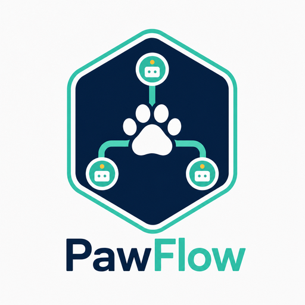

<p align="center">
  <a href="https://pawflow.allcolor.org/">
    
  </a>
</p>

<h1 align="center">PawFlow</h1>

<p align="center">
  <strong>Self-hosted agent runtime for real infrastructure.</strong><br>
  Run durable AI agents against your own files, tools, browsers, desktops, services, and workflows.
</p>

<p align="center">
  <a href="https://pawflow.allcolor.org/"><strong>Website</strong></a>
  · <a href="https://pawflow.allcolor.org/quickstart.html">Quickstart</a>
  · <a href="https://pawflow.allcolor.org/docs.html">Docs</a>
  · <a href="https://github.com/allcolor/PawFlow-Agents/releases/latest">Releases</a>
</p>

<p align="center">
  <a href="https://pawflow.allcolor.org/assets/media/video/vision-fallback-demo.mp4">▶ <strong>70-second demo</strong></a> — a <em>text-only</em> GLM 5.2 operates a Linux desktop, opens Chromium, and plays a song on YouTube. Every screenshot is described to it by a separate vision model (<a href="https://pawflow.allcolor.org/howtos.html#delegated-vision">delegated vision</a>). The demo video itself was cut, narrated, and scored by a Claude agent running inside PawFlow.
</p>

<p align="center">
  <a href="https://github.com/allcolor/PawFlow-Agents/actions"></a>
  <a href="LICENSE"></a>
  <a href="https://www.python.org/"></a>
  <a href="https://github.com/allcolor/PawFlow-Agents/releases"></a>
</p>

<p align="center">
  <a href="https://pawflow.allcolor.org/"></a>
  <a href="https://pawflow.allcolor.org/quickstart.html"></a>
</p>

<p align="center">
  <strong>👉 Screenshots, live feature tour, quickstart, and full documentation live on <a href="https://pawflow.allcolor.org/">pawflow.allcolor.org</a>.</strong>
</p>

<p align="center">
  <em>The <strong>Ask PawFlow</strong> help bot on the website is powered by a PawFlow agent flow (<code>web_help_bot</code>, behind <code>/api/help</code>).</em>
</p>

---

PawFlow is the runtime layer between chat agents, local tools, and production workflows. The server keeps conversations, context, memory, files, flows, and provider sessions durable. Relays execute filesystem, shell, browser, desktop, and media tools next to the machines where the work actually happens.

Use it when a hosted coding assistant is too boxed-in, a workflow tool is too rigid, and a library is not enough runtime.

## Why PawFlow

PawFlow gives agents a real operating surface without handing your workspace to a vendor-controlled agent cloud.

- **Relay-backed tools**: read, edit, grep, run commands, browse, control desktops, generate media, and inspect projects through explicit relay routes.
- **Durable context**: conversations, shared context, per-agent context, memory, knowledge graphs, diaries, project graphs, files, and buckets survive restarts.
- **Skill learning loop**: agents crystallize hard-won procedures into skills, update skills that proved wrong during use, and get conservative skill drafts proposed from compaction summaries; skill usage is tracked and a `skillCurator` flow task produces review-first maintenance reports — nothing is archived or promoted without your confirmation.
- **Encryption at rest (opt-in)**: per-conversation passphrase encryption of message content, thinking, and tool I/O (and conv-scoped relay workspaces via CryFS); keys live in RAM only, so a stopped server leaves only ciphertext on disk. Off by default and transparent to conversations that don't use it.
- **Multi-provider agents**: mix Codex app-server, Claude Code, Antigravity/Agy, Gemini CLI, Anthropic, OpenAI, and OpenAI-compatible services per agent or conversation.
- **Native CLI engines, not API reimplementations**: subscription providers run the real Codex app-server, Claude Code, Antigravity, and Gemini CLI engines per conversation — native harness, threads, and reasoning preserved — with native Codex plugins (`codex_plugins`) and Claude Code plugin marketplaces (`claude_plugins`/`claude_marketplaces`) declarable per LLM service.
- **Delegated vision**: pair a strong text-only reasoning model with a separate vision-enabled LLM so uploads, screenshots, and desktop views become detailed descriptions with UI coordinates before the reasoning turn. Images sent to a text-only model are never silently dropped: any model — including free-tier ones — gets vision, and clicks stay accurate because coordinates come from the vision model, verified locally by the pre-click screen guard.
- **Shared clients**: continue the same conversation from the web UI, PawCode CLI, VS Code, API clients, or channel integrations.
- **Deterministic flows**: turn repeated work into NiFi-style DAGs with scheduling, backpressure, checkpoints, approvals, and explicit LLM steps.
- **Package ecosystem**: distribute agents, skills, tools, services, flow tasks, flows, and UI extensions as signed `.pfp` packages or import skills from supported marketplaces.

## What You Can Build

- Agentic coding sessions against a linked workspace, with persistent context and auditable tool output.
- Multi-agent operations where planners, coders, reviewers, researchers, and verifiers work in the same conversation.
- Browser and desktop automation for workflows that do not have clean APIs.
- Vision-guided desktop agents built from a text-only reasoning model and an independently selected vision model.
- Realtime voice conversations with your agents — speech-to-speech sessions (OpenAI Realtime or Gemini Live) with live captions, barge-in, tool use, and Telegram voice-note replies, persisted as normal conversation history.
- Media pipelines that create images, video, audio, 3D assets, voice, and FileStore outputs.
- Scheduled operational flows: daily digests, inbox triage, data transforms, reports, monitoring, and webhook-driven automation.
- Reusable packages and registries for sharing internal or community agents, skills, tools, services, flow tasks, flows, and UI extensions.
- Live help bots: the **Ask PawFlow** assistant on [pawflow.allcolor.org](https://pawflow.allcolor.org/) is powered by a PawFlow agent flow (`web_help_bot`) answering questions in real time, with a Telegram counterpart (`telegram_help_bot`).
- Portable conversations with full PawFlow archives, including optional FileStore attachments and generated files.

## Quick Start

> 📖 Prefer a guided version with screenshots? Follow the
> [quickstart on the website](https://pawflow.allcolor.org/quickstart.html).

The easiest path is the Docker installer from the latest release. It starts PawFlow, opens the bootstrap wizard, creates the first admin user, configures the selected LLM services, deploys the starter flow, and opens your first agent conversation.

### Docker Installer

Downloadable artifacts are published on the [latest GitHub release](https://github.com/allcolor/PawFlow-Agents/releases/latest): installer zip, PawCode packages, Relay CLI archives, Relay Desktop installers, checksums, and source archives.

```bash
PAWFLOW_VERSION=$(curl -fsSL https://api.github.com/repos/allcolor/PawFlow-Agents/releases/latest \
  | python3 -c 'import json,sys; print(json.load(sys.stdin)["tag_name"])')

curl -L -o "pawflow-install-$PAWFLOW_VERSION.zip" \
  "https://github.com/allcolor/PawFlow-Agents/releases/download/$PAWFLOW_VERSION/pawflow-install-$PAWFLOW_VERSION.zip"
unzip "pawflow-install-$PAWFLOW_VERSION.zip"
cd "pawflow-install-$PAWFLOW_VERSION"

bash scripts/install-pawflow.sh --port PORT --pull-images
```

`--version` is optional: when omitted the installer resolves the latest published
release from GitHub. Pass `--version "$PAWFLOW_VERSION"` to pin a specific release.

On Windows PowerShell with Docker Desktop Linux containers, use the bundled
PowerShell installer instead:

```powershell
powershell -ExecutionPolicy Bypass -File scripts/install-pawflow.ps1 -Port PORT -PullImages
```

`-Version` is likewise optional and defaults to the latest published release; pass
`-Version $env:PAWFLOW_VERSION` to pin a specific release.

Check and apply release updates with:

```bash
bash scripts/install-pawflow.sh --check-updates
bash scripts/install-pawflow.sh --self-update
bash scripts/install-pawflow.sh --version NEW_VERSION --port PORT --pull-images
```

The update command recreates the PawFlow server container on the requested image
while keeping persistent data under `PAWFLOW_HOME`, then removes older PawFlow
server/relay image tags unless `--keep-old-images` is set.

On Linux hosts with AppArmor (Ubuntu, Debian, ...), the installer also loads
the PawFlow AppArmor profiles (`pawflow-mount` for provider pool containers,
`pawflow-relay` for relay containers) into `/etc/apparmor.d/` — sudo may
prompt once. This confines the containers' mount privileges to exactly what
they need; without the profiles PawFlow still works but those containers run
`apparmor=unconfined`. Skip with `--skip-apparmor`, or load them manually
later:

```bash
sudo install -m 644 docker/apparmor/pawflow-mount docker/apparmor/pawflow-relay /etc/apparmor.d/
sudo apparmor_parser -r -W /etc/apparmor.d/pawflow-mount /etc/apparmor.d/pawflow-relay
```

Hosts without AppArmor (Windows/macOS Docker Desktop, WSL2, SELinux distros)
are detected and skipped automatically — nothing to do there.

Open the installer at:

```text
https://localhost:PORT/install
```

The first-run Private Gateway key is `RoyBatty`. Finalizing the wizard replaces it.

### From Source

```bash
git clone https://github.com/allcolor/PawFlow-Agents.git
cd PawFlow-Agents
pip install -r requirements.txt
python cli.py start --host 0.0.0.0 --port PORT
```

Open the web chat at:

```text
http://localhost:PORT/chat
```

## Clients

### Web UI

The web UI is the main operator surface: chat, context editor, memory editor, file attachments, relay tools, desktop entry points, terminals, provider sessions, and flow actions in one place.

### PawCode CLI

PawCode is a terminal client for the same PawFlow conversations. It can be used interactively or in Claude Code-compatible stream-JSON mode.

```bash
pawcode --server http://localhost:PORT

echo '{"type":"user","message":{"role":"user","content":"hello"}}' | \
  pawcode --input-format stream-json --output-format stream-json
```

### VS Code

The VS Code extension attaches to the same PawFlow conversation and resource panel from inside your editor.

### Telegram

Telegram bridges chats into the same conversations: message a BotFather bot and agents reply inline (web login uses the Telegram Login Widget).

## Architecture

```
┌─────────────────────────────────────────────────────────────────┐
│                        PawFlow Server                           │
│                                                                 │
│  ┌──────────┐  ┌──────────┐  ┌─────────┐  ┌────────────────┐  │
│  │  Agents  │  │ Pipeline │  │   Auth   │  │  Web Chat UI   │  │
│  │  (LLM +  │  │  Engine  │  │ Gateway  │  │  (SSE, files,  │  │
│  │  tools)  │  │ (100+    │  │ (9 OAuth │  │   context,     │  │
│  │          │  │  tasks)  │  │ provid.) │  │   commands)    │  │
│  └────┬─────┘  └──────────┘  └──────────┘  └────────────────┘  │
│       │                                                         │
│  ┌────┴─────────────────────────────────────────────────────┐  │
│  │              90+ Tool Handlers (via relay)                │  │
│  │  bash, read, write, edit, glob, grep, web_search,        │  │
│  │  screen, browser, generate_image, generate_video,        │  │
│  │  generate_audio, generate_3d, clone_voice, speak,        │  │
│  │  remember, kg_add, project_graph, delegate, plans, ...   │  │
│  └──────────────────────────┬───────────────────────────────┘  │
│                             │ WebSocket                        │
└─────────────────────────────┼──────────────────────────────────┘
                              │
                    ┌─────────┴─────────┐
                    │   Relay (Docker)   │  ← runs on user's machine
                    │   or native host   │
                    └───────────────────┘
```

The **server** hosts the API, agent orchestration, pipeline engine, and web UI. A **relay** runs on the user's machine (or in a Docker container) and executes tools — filesystem access, bash commands, code edits — over a WebSocket connection. This means agents can manipulate your local codebase without the server needing direct access to your files. Connect a relay with the relay CLI or Relay Desktop to attach workspaces, desktops, browsers, and terminals.

## LLM Providers

| Provider | Mode | Features |
|---|---|---|
| **Claude Code** | CLI subprocess/container + MCP | Non-interactive coding turns, session persistence, thinking |
| **Claude Code interactive** | Interactive CLI container + observed stream | Claude subscription sessions, live control, provider-observed usage |
| **Codex app-server** | App-server protocol in pooled container | Codex subscription or OpenAI API-key coding agents, threads, steering |
| **Antigravity / Agy** | Interactive CLI container + observed stream | Default Gemini subscription provider, Gemini OAuth pool, MCP tools |
| **Gemini CLI** | CLI subprocess/container | Secondary Gemini CLI path for Pro/CLI-specific workflows |
| **Anthropic API** | Direct HTTP | Streaming, tool use, vision, extended thinking |
| **OpenAI API** | Direct HTTP | Streaming, tool use, vision, JSON mode |
| **OpenAI-compatible** | Direct HTTP | Local/self-hosted and third-party compatible endpoints via `base_url` |

Switch providers per agent, per conversation, or globally. API keys normally use direct `openai`/`anthropic` services; subscription logins use the matching CLI-backed provider (`codex-app-server`, `claude-code-interactive`, or `antigravity-interactive`). Self-hosted and third-party LLMs can use the OpenAI-compatible endpoint (`base_url` override). See [LLM Providers](docs/llm_providers.md).

### Multi-LLM Advisor Aggregation

An `llmAggregator` consults several direct `llmConnection` services in parallel before a final LLM answers or performs the requested work. Each advisor inspects the request and returns an internal implementation plan; only the final aggregator streams to the user and runs the normal visible tool loop.

```json
{
  "type": "llmAggregator",
  "aggregator_llm_service": "llm_final",
  "advisor_llm_services": ["llm_architect", "llm_reviewer"],
  "max_parallel_advisors": 2,
  "advisor_max_iterations": 20,
  "failure_policy": "best_effort",
  "enforce_read_only": true
}
```

Advisor contexts are silent and ephemeral. With `enforce_read_only: true` (the default), advisors receive a fail-closed read-only tool set, including through CLI-backed providers; the final LLM keeps the conversation's normal tools and approval policy. Advisor usage is tracked separately so it does not inflate the main context gauge. See the [multi-LLM aggregator how-to](https://pawflow.allcolor.org/howtos.html#multi-llm-aggregator) and [technical guide](docs/llm_aggregator.md).

### Delegated Vision for Text-Only Models

An LLM service with `supports_vision: false` can delegate every incoming image to another vision-enabled `llmConnection`. PawFlow asks that service for visible text, layout, UI controls, states, and approximate pixel coordinates, then replaces the image with that description only for the text model's outbound call. The stored conversation retains the original image.

```json
{
  "default_model": "glm-5.2:cloud",
  "supports_vision": false,
  "vision_llm_service": "ollama_gemma4_vision"
}
```

This lets a model such as GLM 5.2 inspect uploads and use `screen`/`see`/`read` results through Gemma 4 Cloud, while GLM remains the agent's reasoning model and desktop-tool caller. Descriptions are cached by image content hash. See the [GLM 5.2 + Gemma 4 how-to](https://pawflow.allcolor.org/howtos.html#delegated-vision) and the [technical provider reference](docs/llm_providers.md#vision-fallback-for-non-vision-models).

## Agent Capabilities

### Cognitive Systems

Agents have persistent memory that survives across conversations:

| System | Purpose | Storage |
|--------|---------|--------|
| **Memory** | Facts, preferences, events organized in wing/hall/room taxonomy | `data/memories/{user}.json` |
| **Knowledge Graph** | Entity-relationship triples with temporal validity | `data/knowledge_graphs/{user}.json` |
| **Agent Diary** | Personal observations, decisions, learnings per agent | `data/memories/{user}/diary_{agent}.jsonl` |
| **Project Graph** | AST-based code structure graph (17 languages via tree-sitter) | `data/graphs/{user}/{conv}/graph.json` |

Memory digests and diary entries are automatically injected into the system prompt.

### Multi-Agent

- Delegate tasks to sub-agents with `delegate()`
- Each sub-agent gets its own LLM, tools, and conversation context
- Agents can run in parallel or sequentially
- Git worktree isolation for parallel coding tasks is on the roadmap

### Plans

- Create structured multi-step plans with `create_plan()`
- Step-by-step execution with approval gates
- Assign steps to different agents
- Verify completed work before moving on

## Pipeline Engine

100+ tasks across 5 categories for data processing workflows:

| Category | Count | Examples |
|----------|-------|----------|
| **System** | 11+ | log, wait, executeScript, cronTrigger, listFiles |
| **IO** | 50+ | HTTP, Telegram, Discord, Slack, WhatsApp, S3, GCS, Azure, SFTP, Kafka, MQTT, email, chat UI, relay |
| **Data** | 25+ | transformJSON, inferLLM, executeSQL, compressContent, validateJSON, Avro/Parquet |
| **Control** | 10+ | routeOnAttribute, splitContent, mergeContent, controlRate, subflows, wait/notify |
| **AI** | 2+ | agentLoop, agentActions, tool-use cycle |

Flows are defined in JSON, executed as DAGs, and support backpressure, checkpointing, crash recovery, parameter contexts, subflows, and CRON scheduling.

## Packages and Marketplace

PawFlow Packages (`.pfp`) are signed zip artifacts for distributing PawFlow resources. A package can include agents, prompts, skills, themes, task definitions, flows, service definitions, tools, service providers, flow tasks, task providers, and UI extensions. Install is review-first: PawFlow verifies the package signature and lock file, shows a selectable install plan, records per-object provenance, and executes code-bearing objects through a relay runtime instead of importing third-party code into the server process.

Common package workflows:

```bash
/pfp key-create
/pfp build ./my-package.pfpdir --key-env PAWFLOW_PFP_SIGNING_KEY
/pfp inspect ./dist/my-package-1.0.0.pfp
/pfp install ./dist/my-package-1.0.0.pfp --include skill:x,service_provider:y
/pfp dev-load ./my-package.pfpdir --include service_provider:image --secret api_key=my_provider_key
/pfp export --package my.bundle --version 0.1.0 --include agent:helper,flow:daily --out ./my.bundle.pfpdir
```

Marketplace and registry support is decentralized. Users can add static package registries, search them, inspect remote packages with explicit download confirmation, then install or update selected objects. Skill marketplace import is also supported for Codex/OpenAI skills, Claude/Anthropic plugin marketplaces, HermesHub, and OpenClaw GitHub tree URLs; imports are bounded, reviewed, and never grant tool permissions automatically.

See [PawFlow Packages](docs/PFP_PACKAGES.md), [PFP Developer Guide](docs/PFP_DEVELOPER_GUIDE.md), [PFP Publisher Guide](docs/PFP_PUBLISHER_GUIDE.md), and [Marketplace](docs/marketplace.md).

### Expression Language

40+ chainable operations for dynamic configuration:

```
${name:upper}                                     → "ALICE"
${api_key:default("not-set")}                      → uses fallback if empty
${status:equals("active"):then("ON"):else("OFF")}  → conditional logic
${csv_line:split(","):index(0):trim}               → first CSV field, trimmed
${response:json_get("data.items.0.id")}             → extract from JSON
${content:hash_sha256}                              → hash a value
${:uuid}                                            → generate a UUID
${:now:format("yyyy-MM-dd")}                         → "2026-04-08"
```

Expressions resolve through a cascade: secrets → flow parameters → conversation → user → global → environment variables. See [Expression Language docs](docs/EXPRESSION_LANGUAGE.md) for the full reference.

## Web Chat

- Real-time streaming via SSE
- Shared conversations across web, PawCode CLI, VS Code, API clients, and channel flows
- File explorer with relay filesystem access
- Context editor (view/edit agent context)
- Conversation management with auto-titles
- Drag & drop file attachments and FileStore outputs
- 60+ slash commands (`/agent`, `/memory`, `/relay`, `/run`, `/plan`, `/desktop`, ...)
- Desktop/VNC entry points plus relay-backed `screen` actions
- Escape key: 1x = graceful interrupt, 2x = force stop
- Multi-agent with agent switching

## Authentication

9 OAuth providers out of the box:

| Provider | Status |
|----------|--------|
| Built-in (username/password) | Ready, tested |
| Generic OAuth2 | Ready, tested |
| Google | Ready, tested |
| GitHub | Ready, tested |
| X (Twitter) | Ready, tested |
| Telegram | Ready, tested |
| Microsoft | Ready, not tested |
| Facebook | Ready, not tested |
| Amazon | Ready, not tested |

## Configuration

Agents, services, and flows are configured via JSON. Parameters cascade: flow → conversation → user → global.

```json
{
  "llm_service": "claude_code_llm_service",
  "summarizer_service": "claude_code_llm_service",
  "permission_mode": "auto",
  "max_iterations": 200
}
```

See `.env.example` for environment variables.

## Tests

```bash
pytest tests/ -v    # 2500+ tests across 100+ test files
```

## Documentation

| Document | Description |
|----------|-------------|
| [Architecture](docs/architecture.md) | Internal architecture, FlowFile, components |
| [Agent System](docs/AGENT_SYSTEM.md) | Agent loop, context, plans, multi-agent, streaming |
| [Cognitive Tools](docs/COGNITIVE_TOOLS.md) | Memory, KG, diary, project graph (21 tools) |
| [Skill Learning Loop](docs/LEARNING_LOOP_PLAN.md) | Agent-created skills, drafts from compaction, usage stats, curator task |
| [Expression Language](docs/EXPRESSION_LANGUAGE.md) | 40+ operators, scopes, cascade |
| [Slash Commands](docs/SLASH_COMMANDS.md) | All webchat commands |
| [LLM Providers](docs/llm_providers.md) | OpenAI, Anthropic, Claude Code, Codex app-server, Antigravity/Agy, Gemini CLI, compatible APIs |
| [PawCode CLI](docs/pawcode.md) | Terminal client and stream-JSON mode |
| [VS Code Extension](docs/vscode.md) | Editor client and resource panel |
| [Multi-Client Conversations](docs/multi_client_conversations.md) | Shared runtime across web, CLI, VS Code, API, channels |
| [Desktop/VNC](docs/desktop_vnc.md) | noVNC desktop, screen tool, audio notes |
| [Media Tools](docs/media_tools.md) | Image/video/audio/3D/voice tools, realtime voice conversation |
| [Tool Catalog](docs/tool_catalog.md) | Agent-facing tools |
| [Services Catalog](docs/services.md) | Service types and provider integrations |
| [Task Catalog](docs/tasks.md) | Built-in flow tasks and tool tasks |
| [PawFlow Packages](docs/PFP_PACKAGES.md) | Signed `.pfp` packages, install plans, registries, export/build, and security model |
| [PFP Developer Guide](docs/PFP_DEVELOPER_GUIDE.md) | Local package development with `dev-load`, service providers, flow tasks, media artifacts, and SDK patterns |
| [PFP Publisher Guide](docs/PFP_PUBLISHER_GUIDE.md) | Registry publishing, versioning, SHA pinning, and key rotation |
| [Marketplace](docs/marketplace.md) | PFP registries, skill marketplace import, review model, and UI/CLI entry points |
| [Security Model](docs/security_model.md) | Trust boundaries, encryption at rest, and production checklist |
| [Encryption at Rest (RFC)](docs/design/encryption-at-rest.md) | Opt-in conversation/workspace encryption: keys, wraps, key-relay, threat model |
| [Deployment](docs/deployment.md) | Local, Docker, production |
| [Docker](docs/docker.md) | Docker setup, relay mode |
| [Filesystem](docs/filesystem.md) | Relay, backends, permissions |
| [Development](docs/development.md) | Creating custom tasks/services |

## Roadmap

See [ROADMAP.md](ROADMAP.md) for the full roadmap.

Key upcoming areas:

- Stabilization and release hardening
- Manual flow editor
- New media service providers
- Git worktree isolation for parallel agents
- Mobile client (PWA)
- MCP elicitation and PawFlow as an MCP server
- Filesystem hooks
- Full cost tracking dashboard

## Contributing

See [CONTRIBUTING.md](CONTRIBUTING.md). In short:

1. Fork & clone
2. `pip install -r requirements.txt`
3. Make changes, run `pytest tests/`
4. Open a PR

## License

[MIT](LICENSE)

---

<p align="center">
  <a href="https://pawflow.allcolor.org/"><strong>🌐 pawflow.allcolor.org</strong></a> — website, feature tour, quickstart, and docs.
</p>
