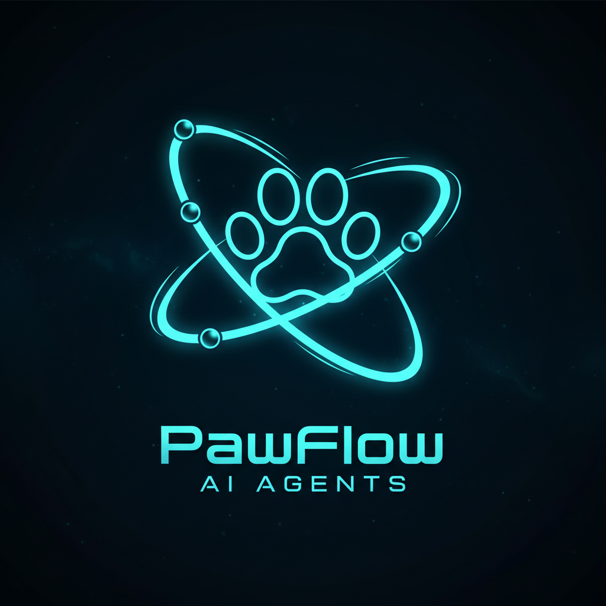

<p align="center">
  <a href="https://pawflow.allcolor.org/">
    
  </a>
</p>

<h1 align="center">PawFlow</h1>

<p align="center">
  <strong>Self-hosted agent runtime for real infrastructure.</strong><br>
  Run durable AI agents against your own files, tools, browsers, desktops, services, and workflows.
</p>

<p align="center">
  <a href="https://pawflow.allcolor.org/"><strong>Website</strong></a>
  · <a href="https://pawflow.allcolor.org/quickstart.html">Quickstart</a>
  · <a href="https://pawflow.allcolor.org/docs.html">Docs</a>
  · <a href="https://github.com/allcolor/PawFlow-Agents/releases/latest">Releases</a>
</p>

<p align="center">
  <a href="https://github.com/allcolor/PawFlow-Agents/actions"></a>
  <a href="LICENSE"></a>
  <a href="https://www.python.org/"></a>
  <a href="https://github.com/allcolor/PawFlow-Agents/releases"></a>
</p>

---

PawFlow is the runtime layer between chat agents, local tools, and production workflows. The server keeps conversations, context, memory, files, flows, and provider sessions durable. Relays execute filesystem, shell, browser, desktop, and media tools next to the machines where the work actually happens.

Use it when a hosted coding assistant is too boxed-in, a workflow tool is too rigid, and a library is not enough runtime.

## Why PawFlow

PawFlow gives agents a real operating surface without handing your workspace to a vendor-controlled agent cloud.

- **Relay-backed tools**: read, edit, grep, run commands, browse, control desktops, generate media, and inspect projects through explicit relay routes.
- **Durable context**: conversations, shared context, per-agent context, memory, knowledge graphs, diaries, project graphs, files, and buckets survive restarts.
- **Multi-provider agents**: mix Codex app-server, Claude Code, Antigravity/Agy, Gemini CLI, Anthropic, OpenAI, and OpenAI-compatible services per agent or conversation.
- **Shared clients**: continue the same conversation from the web UI, PawCode CLI, VS Code, API clients, or channel integrations.
- **Deterministic flows**: turn repeated work into NiFi-style DAGs with scheduling, backpressure, checkpoints, approvals, and explicit LLM steps.

## What You Can Build

- Agentic coding sessions against a linked workspace, with persistent context and auditable tool output.
- Multi-agent operations where planners, coders, reviewers, researchers, and verifiers work in the same conversation.
- Browser and desktop automation for workflows that do not have clean APIs.
- Media pipelines that create images, video, audio, 3D assets, voice, and FileStore outputs.
- Scheduled operational flows: daily digests, inbox triage, data transforms, reports, monitoring, and webhook-driven automation.
- Portable conversations with full PawFlow archives, including optional FileStore attachments and generated files.

## Quick Start

The easiest path is the Docker installer from the latest release. It starts PawFlow, opens the bootstrap wizard, creates the first admin user, configures the selected LLM services, deploys the starter flow, and opens your first agent conversation.

### Docker Installer

Downloadable artifacts are published on the [latest GitHub release](https://github.com/allcolor/PawFlow-Agents/releases/latest): installer zip, PawCode packages, Relay CLI archives, Relay Desktop installers, checksums, and source archives.

```bash
PAWFLOW_VERSION=$(curl -fsSL https://api.github.com/repos/allcolor/PawFlow-Agents/releases/latest \
  | python3 -c 'import json,sys; print(json.load(sys.stdin)["tag_name"])')

curl -L -o "pawflow-install-$PAWFLOW_VERSION.zip" \
  "https://github.com/allcolor/PawFlow-Agents/releases/download/$PAWFLOW_VERSION/pawflow-install-$PAWFLOW_VERSION.zip"
unzip "pawflow-install-$PAWFLOW_VERSION.zip"
cd "pawflow-install-$PAWFLOW_VERSION"

bash scripts/install-pawflow.sh --port PORT --pull-images --version "$PAWFLOW_VERSION"
```

Open the installer at:

```text
https://localhost:PORT/install
```

The first-run Private Gateway key is `RoyBetty`. Finalizing the wizard replaces it.

### From Source

```bash
git clone https://github.com/allcolor/PawFlow-Agents.git
cd PawFlow-Agents
pip install -r requirements.txt
python cli.py start --host 0.0.0.0 --port PORT
```

Open the web chat at:

```text
http://localhost:PORT/chat
```

## Clients

### Web UI

The web UI is the main operator surface: chat, context editor, memory editor, file attachments, relay tools, desktop entry points, terminals, provider sessions, and flow actions in one place.

### PawCode CLI

PawCode is a terminal client for the same PawFlow conversations. It can be used interactively or in Claude Code-compatible stream-JSON mode.

```bash
pawcode --server http://localhost:PORT

echo '{"type":"user","message":{"role":"user","content":"hello"}}' | \
  pawcode --input-format stream-json --output-format stream-json
```

### VS Code and Relays

Use the relay CLI or Relay Desktop to connect workspaces, desktops, browsers, and terminals. The VS Code extension can attach to the same conversation and resource panel.
## Architecture

```
┌─────────────────────────────────────────────────────────────────┐
│                        PawFlow Server                           │
│                                                                 │
│  ┌──────────┐  ┌──────────┐  ┌─────────┐  ┌────────────────┐  │
│  │  Agents  │  │ Pipeline │  │   Auth   │  │  Web Chat UI   │  │
│  │  (LLM +  │  │  Engine  │  │ Gateway  │  │  (SSE, files,  │  │
│  │  tools)  │  │ (100+    │  │ (9 OAuth │  │   context,     │  │
│  │          │  │  tasks)  │  │ provid.) │  │   commands)    │  │
│  └────┬─────┘  └──────────┘  └──────────┘  └────────────────┘  │
│       │                                                         │
│  ┌────┴─────────────────────────────────────────────────────┐  │
│  │              90+ Tool Handlers (via relay)                │  │
│  │  bash, read, write, edit, glob, grep, web_search,        │  │
│  │  screen, browser, generate_image, generate_video,        │  │
│  │  generate_audio, generate_3d, clone_voice, speak,        │  │
│  │  remember, kg_add, project_graph, delegate, plans, ...   │  │
│  └──────────────────────────┬───────────────────────────────┘  │
│                             │ WebSocket                        │
└─────────────────────────────┼──────────────────────────────────┘
                              │
                    ┌─────────┴─────────┐
                    │   Relay (Docker)   │  ← runs on user's machine
                    │   or native host   │
                    └───────────────────┘
```

The **server** hosts the API, agent orchestration, pipeline engine, and web UI. A **relay** runs on the user's machine (or in a Docker container) and executes tools — filesystem access, bash commands, code edits — over a WebSocket connection. This means agents can manipulate your local codebase without the server needing direct access to your files.

## LLM Providers

| Provider | Mode | Features |
|---|---|---|
| **Claude Code** | CLI subprocess/container + MCP | Non-interactive coding turns, session persistence, thinking |
| **Claude Code interactive** | Interactive CLI container + observed stream | Claude subscription sessions, live control, provider-observed usage |
| **Codex app-server** | App-server protocol in pooled container | Codex subscription or OpenAI API-key coding agents, threads, steering |
| **Antigravity / Agy** | Interactive CLI container + observed stream | Default Gemini subscription provider, Gemini OAuth pool, MCP tools |
| **Gemini CLI** | CLI subprocess/container | Secondary Gemini CLI path for Pro/CLI-specific workflows |
| **Anthropic API** | Direct HTTP | Streaming, tool use, vision, extended thinking |
| **OpenAI API** | Direct HTTP | Streaming, tool use, vision, JSON mode |
| **OpenAI-compatible** | Direct HTTP | Local/self-hosted and third-party compatible endpoints via `base_url` |

Switch providers per agent, per conversation, or globally. API keys normally use direct `openai`/`anthropic` services; subscription logins use the matching CLI-backed provider (`codex-app-server`, `claude-code-interactive`, or `antigravity-interactive`). Self-hosted and third-party LLMs can use the OpenAI-compatible endpoint (`base_url` override). See [LLM Providers](docs/llm_providers.md).

## Agent Capabilities

### Cognitive Systems

Agents have persistent memory that survives across conversations:

| System | Purpose | Storage |
|--------|---------|--------|
| **Memory** | Facts, preferences, events organized in wing/hall/room taxonomy | `data/memories/{user}.json` |
| **Knowledge Graph** | Entity-relationship triples with temporal validity | `data/knowledge_graphs/{user}.json` |
| **Agent Diary** | Personal observations, decisions, learnings per agent | `data/memories/{user}/diary_{agent}.jsonl` |
| **Project Graph** | AST-based code structure graph (17 languages via tree-sitter) | `data/graphs/{user}/{conv}/graph.json` |

Memory digests and diary entries are automatically injected into the system prompt.

### Multi-Agent

- Delegate tasks to sub-agents with `delegate()`
- Each sub-agent gets its own LLM, tools, and conversation context
- Agents can run in parallel or sequentially
- Git worktree isolation for parallel coding tasks

### Plans

- Create structured multi-step plans with `create_plan()`
- Step-by-step execution with approval gates
- Assign steps to different agents
- Verify completed work before moving on

## Pipeline Engine

100+ tasks across 5 categories for data processing workflows:

| Category | Count | Examples |
|----------|-------|----------|
| **System** | 11+ | log, wait, executeScript, cronTrigger, listFiles |
| **IO** | 50+ | HTTP, Telegram, Discord, Slack, WhatsApp, S3, GCS, Azure, SFTP, Kafka, MQTT, email, chat UI, relay |
| **Data** | 25+ | transformJSON, inferLLM, executeSQL, compressContent, validateJSON, Avro/Parquet |
| **Control** | 10+ | routeOnAttribute, splitContent, mergeContent, controlRate, subflows, wait/notify |
| **AI** | 2+ | agentLoop, agentActions, tool-use cycle |

Flows are defined in JSON, executed as DAGs, and support backpressure, checkpointing, crash recovery, parameter contexts, subflows, and CRON scheduling.

### Expression Language

40+ chainable operations for dynamic configuration:

```
${name:upper}                                     → "ALICE"
${api_key:default("not-set")}                      → uses fallback if empty
${status:equals("active"):then("ON"):else("OFF")}  → conditional logic
${csv_line:split(","):index(0):trim}               → first CSV field, trimmed
${response:json_get("data.items.0.id")}             → extract from JSON
${content:hash_sha256}                              → hash a value
${:uuid}                                            → generate a UUID
${:now:format("yyyy-MM-dd")}                         → "2026-04-08"
```

Expressions resolve through a cascade: secrets → flow parameters → conversation → user → global → environment variables. See [Expression Language docs](docs/EXPRESSION_LANGUAGE.md) for the full reference.

## Web Chat

- Real-time streaming via SSE
- Shared conversations across web, PawCode CLI, VS Code, API clients, and channel flows
- File explorer with relay filesystem access
- Context editor (view/edit agent context)
- Conversation management with auto-titles
- Drag & drop file attachments and FileStore outputs
- 60+ slash commands (`/agent`, `/memory`, `/relay`, `/run`, `/plan`, `/desktop`, ...)
- Desktop/VNC entry points plus relay-backed `screen` actions
- Escape key: 1x = graceful interrupt, 2x = force stop
- Multi-agent with agent switching

## Authentication

9 OAuth providers out of the box:

| Provider | Status |
|----------|--------|
| Built-in (username/password) | Ready |
| Google | Ready, tested |
| GitHub | Ready, not tested |
| Microsoft | Ready, not tested |
| X (Twitter) | Ready, not tested |
| Facebook | Ready, not tested |
| Amazon | Ready, not tested |
| Telegram | Ready, not tested |
| Generic OAuth2 | Ready, tested |

## Configuration

Agents, services, and flows are configured via JSON. Parameters cascade: flow → conversation → user → global.

```json
{
  "llm_service": "claude_code_llm_service",
  "summarizer_service": "claude_code_llm_service",
  "permission_mode": "auto",
  "max_iterations": 200
}
```

See `.env.example` for environment variables.

## Tests

```bash
pytest tests/ -v    # 2500+ tests across 100+ test files
```

## Documentation

| Document | Description |
|----------|-------------|
| [Architecture](docs/architecture.md) | Internal architecture, FlowFile, components |
| [Agent System](docs/AGENT_SYSTEM.md) | Agent loop, context, plans, multi-agent, streaming |
| [Cognitive Tools](docs/COGNITIVE_TOOLS.md) | Memory, KG, diary, project graph (21 tools) |
| [Expression Language](docs/EXPRESSION_LANGUAGE.md) | 40+ operators, scopes, cascade |
| [Slash Commands](docs/SLASH_COMMANDS.md) | All webchat commands |
| [LLM Providers](docs/llm_providers.md) | OpenAI, Anthropic, Claude Code, Codex app-server, Antigravity/Agy, Gemini CLI, compatible APIs |
| [PawCode CLI](docs/pawcode.md) | Terminal client and stream-JSON mode |
| [VS Code Extension](docs/vscode.md) | Editor client and resource panel |
| [Multi-Client Conversations](docs/multi_client_conversations.md) | Shared runtime across web, CLI, VS Code, API, channels |
| [Desktop/VNC](docs/desktop_vnc.md) | noVNC desktop, screen tool, audio notes |
| [Media Tools](docs/media_tools.md) | Image/video/audio/3D/voice tools |
| [Tool Catalog](docs/tool_catalog.md) | Agent-facing tools |
| [Services Catalog](docs/services.md) | Service types and provider integrations |
| [Task Catalog](docs/tasks.md) | Built-in flow tasks and tool tasks |
| [Security Model](docs/security_model.md) | Trust boundaries and production checklist |
| [Deployment](docs/deployment.md) | Local, Docker, production |
| [Docker](docs/docker.md) | Docker setup, relay mode |
| [Filesystem](docs/filesystem.md) | Relay, backends, permissions |
| [Development](docs/development.md) | Creating custom tasks/services |

## Roadmap

See [ROADMAP.md](ROADMAP.md) for the full roadmap.

Key upcoming areas:

- Voice input (push-to-talk / transcription)
- Git worktree isolation for parallel agents
- Mobile PWA client
- Marketplace for agents, skills, tools, MCP servers, tasks, and flows
- Full flow editor
- Installation wizard

## Contributing

See [CONTRIBUTING.md](CONTRIBUTING.md). In short:

1. Fork & clone
2. `pip install -r requirements.txt`
3. Make changes, run `pytest tests/`
4. Open a PR

## License

[MIT](LICENSE)
