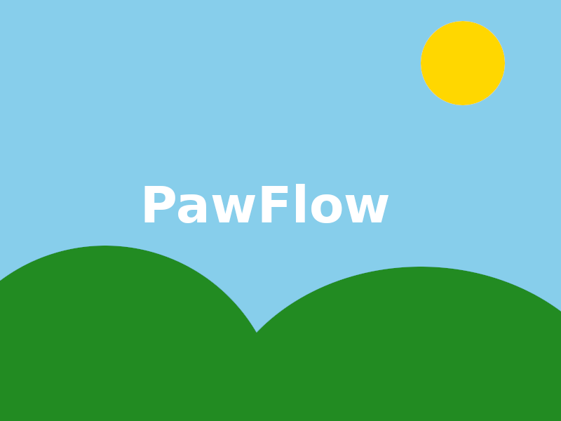

<p align="center">
  
</p>

<h1 align="center">PawFlow</h1>

<p align="center">
  <strong>Your AI agents, your infrastructure, your data.</strong><br>
  Self-hosted AI agent orchestration platform — Apache NiFi meets Claude Code.
</p>

<p align="center">
  <a href="https://github.com/allcolor/PawFlow-Agents/actions"></a>
  <a href="LICENSE"></a>
  <a href="https://www.python.org/"></a>
  <a href="https://github.com/allcolor/PawFlow-Agents/releases"></a>
</p>

---

PawFlow is a self-hosted platform for running autonomous AI agents backed by a visual pipeline engine. No vendor lock-in, no cloud dependency — deploy on your hardware and connect any LLM.

**What makes it different:**

- **Full agent autonomy** — Claude Code, Anthropic API, OpenAI, Gemini with tool-use loops, multi-agent delegation, persistent memory, and knowledge graphs
- **Pipeline engine** — NiFi-style DAG execution with 101 task types, backpressure, checkpointing, crash recovery, and a visual flow editor
- **80+ built-in tools** — filesystem, bash, code editing, web scraping, image/video/audio generation, security scanning, and more
- **Self-hosted** — your conversations, memories, and code stay on your machines

## Quick Start

### With pip

```bash
git clone https://github.com/allcolor/PawFlow-Agents.git
cd PawFlow-Agents
pip install -r requirements.txt

# Start the server
python cli.py run --flow data/deployments/global/pawflow-agent.json

# Open the web chat at http://localhost:9090
```

### With Docker

```bash
git clone https://github.com/allcolor/PawFlow-Agents.git
cd PawFlow-Agents
cp .env.example .env   # edit .env with your secrets

docker compose up -d
# API available at http://localhost:8000
```

### PawCode CLI

A drop-in replacement for Claude Code that talks to your PawFlow server:

```bash
# Interactive mode
pawcode --server http://localhost:9090

# Stream-JSON mode (Claude Code compatible)
echo '{"type":"user","message":{"role":"user","content":"hello"}}' | \
  pawcode --input-format stream-json --output-format stream-json
```

## Architecture

```
┌─────────────────────────────────────────────────────────────────┐
│                        PawFlow Server                           │
│                                                                 │
│  ┌──────────┐  ┌──────────┐  ┌─────────┐  ┌────────────────┐  │
│  │  Agents  │  │ Pipeline │  │   Auth   │  │  Web Chat UI   │  │
│  │  (LLM +  │  │  Engine  │  │ Gateway  │  │  (SSE, files,  │  │
│  │  tools)  │  │ (101     │  │ (9 OAuth │  │   context,     │  │
│  │          │  │  tasks)  │  │ provid.) │  │   commands)    │  │
│  └────┬─────┘  └──────────┘  └──────────┘  └────────────────┘  │
│       │                                                         │
│  ┌────┴─────────────────────────────────────────────────────┐  │
│  │              80+ Tool Handlers (via relay)                │  │
│  │  bash, read, write, edit, glob, grep, web_fetch,         │  │
│  │  generate_image, generate_video, security_scan,          │  │
│  │  remember, recall, kg_add, kg_query, diary_write,        │  │
│  │  project_graph, execute_script, delegate, ...            │  │
│  └──────────────────────────┬───────────────────────────────┘  │
│                             │ WebSocket                        │
└─────────────────────────────┼──────────────────────────────────┘
                              │
                    ┌─────────┴─────────┐
                    │   Relay (Docker)   │  ← runs on user's machine
                    │   or native host   │
                    └───────────────────┘
```

The **server** hosts the API, agent orchestration, pipeline engine, and web UI. A **relay** runs on the user's machine (or in a Docker container) and executes tools — filesystem access, bash commands, code edits — over a WebSocket connection. This means agents can manipulate your local codebase without the server needing direct access to your files.

## LLM Providers

| Provider | Mode | Features |
|---|---|---|
| **Claude Code** | Subprocess + MCP | Full tool use via relay, session persistence, thinking |
| **Anthropic API** | Direct HTTP | Streaming, tool use, vision, extended thinking |
| **OpenAI API** | Direct HTTP | Streaming, tool use, vision, JSON mode |
| **Gemini CLI** | Subprocess | Streaming |

Switch providers per agent, per conversation, or globally. Self-hosted LLMs work via the OpenAI-compatible endpoint (`base_url` override).

## Agent Capabilities

### Cognitive Systems

Agents have persistent memory that survives across conversations:

| System | Purpose | Storage |
|--------|---------|--------|
| **Memory** | Facts, preferences, events organized in wing/hall/room taxonomy | `data/memories/{user}.json` |
| **Knowledge Graph** | Entity-relationship triples with temporal validity | `data/knowledge_graphs/{user}.json` |
| **Agent Diary** | Personal observations, decisions, learnings per agent | `data/memories/{user}/diary_{agent}.jsonl` |
| **Project Graph** | AST-based code structure graph (17 languages via tree-sitter) | `data/graphs/{user}/{conv}/graph.json` |

Memory digests and diary entries are automatically injected into the system prompt.

### Multi-Agent

- Delegate tasks to sub-agents with `delegate()`
- Each sub-agent gets its own LLM, tools, and conversation context
- Agents can run in parallel or sequentially
- Git worktree isolation for parallel coding tasks

### Plans

- Create structured multi-step plans with `create_plan()`
- Step-by-step execution with approval gates
- Assign steps to different agents
- Verify completed work before moving on

## Pipeline Engine

101 tasks across 5 categories for data processing workflows:

| Category | Count | Examples |
|----------|-------|----------|
| **System** | 11 | log, wait, executeScript, cronTrigger, listFiles |
| **IO** | 51 | HTTP, Telegram, Discord, Slack, WhatsApp, S3, GCS, Azure, SFTP, Kafka, MQTT, email |
| **Data** | 27 | transformJSON, inferLLM, executeSQL, compressContent, validateJSON |
| **Control** | 11 | routeOnAttribute, splitContent, mergeContent, controlRate |
| **AI** | 1 | agentLoop (the full LLM agent with tool-use cycle) |

Flows are defined in JSON, executed as DAGs, and support backpressure, checkpointing, crash recovery, parameter contexts, subflows, and CRON scheduling.

### NiFi Import

Import existing Apache NiFi flows (XML or JSON export) with automatic processor mapping, Groovy-to-Python script conversion (LLM-assisted), and process group support.

### Expression Language

40+ chainable operations for dynamic configuration:

```
${user.name}                    → "QUENTIN"
totoz            → uses fallback if empty
${content}   → first CSV field, trimmed
d5c16d9e-1fbe-437a-9f10-a4507d539985                              → generates a UUID
${date}     → "2026-04-08"
```

## Web Chat

- Real-time streaming via SSE
- File explorer with relay filesystem access
- Context editor (view/edit agent context)
- Conversation management with auto-titles
- Drag & drop file attachments and `@file` mentions
- 60+ slash commands (`/agent`, `/memory`, `/relay`, `/run`, `/plan`, ...)
- Escape key: 1x = graceful interrupt, 2x = force stop
- Multi-agent with agent switching

## Authentication

9 OAuth providers out of the box:

| Provider | Status |
|----------|--------|
| Built-in (username/password) | Ready |
| Google | Ready |
| GitHub | Ready |
| Microsoft | Ready |
| X (Twitter) | Ready |
| Facebook | Ready |
| Amazon | Ready |
| Telegram | Ready |
| Generic OAuth2 | Ready |

## Configuration

Agents, services, and flows are configured via JSON. Parameters cascade: flow → conversation → user → global.

```json
{
  "llm_service": "claude_code_llm_service",
  "summarizer_service": "claude_code_llm_service",
  "permission_mode": "auto",
  "max_iterations": 200
}
```

See `.env.example` for environment variables.

## Tests

```bash
pytest tests/ -v    # 2500+ tests across 30+ test files
```

## Documentation

| Document | Description |
|----------|-------------|
| [Architecture](docs/architecture.md) | Internal architecture, FlowFile, components |
| [Agent System](docs/AGENT_SYSTEM.md) | Agent loop, context, plans, multi-agent, streaming |
| [Cognitive Tools](docs/COGNITIVE_TOOLS.md) | Memory, KG, diary, project graph (21 tools) |
| [Expression Language](docs/EXPRESSION_LANGUAGE.md) | 40+ operators, scopes, cascade |
| [Slash Commands](docs/SLASH_COMMANDS.md) | All webchat commands |
| [Task Catalog](docs/tasks.md) | 101 tasks with descriptions |
| [Deployment](docs/deployment.md) | Local, Docker, production |
| [Docker](docs/docker.md) | Docker setup, relay mode |
| [Filesystem](docs/filesystem.md) | Relay, backends, permissions |
| [Development](docs/development.md) | Creating custom tasks/services |

## Roadmap

See [ROADMAP.md](ROADMAP.md) for the full roadmap.

Key upcoming areas:
- Voice input (push-to-talk / transcription)
- Git worktree isolation for parallel agents
- Mobile PWA client
- Additional LLM providers (Ollama, Mistral, vLLM)
- PawFlow as MCP server
- Skill marketplace

## Contributing

See [CONTRIBUTING.md](CONTRIBUTING.md). In short:

1. Fork & clone
2. `pip install -r requirements.txt`
3. Make changes, run `pytest tests/`
4. Open a PR

## License

[MIT](LICENSE)
