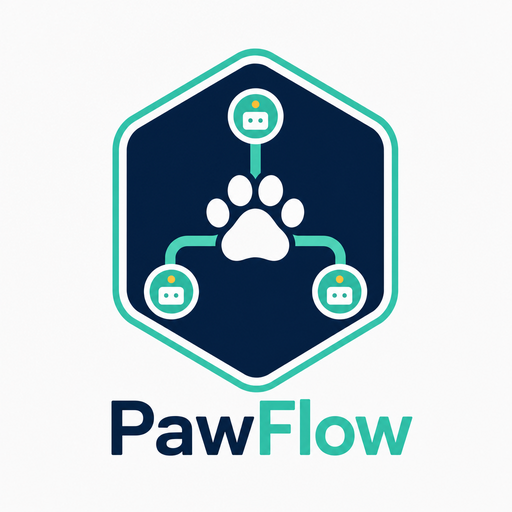

<p align="center">
  <a href="https://pawflow.allcolor.org/">
    
  </a>
</p>

<h1 align="center">PawFlow</h1>

<p align="center">
  <strong>Self-hosted agent runtime for real infrastructure.</strong><br>
  Run durable AI agents against your own files, tools, browsers, desktops, services, and workflows.
</p>

<p align="center">
  <a href="https://pawflow.allcolor.org/"><strong>Website</strong></a>
  · <a href="https://pawflow.allcolor.org/quickstart.html">Quickstart</a>
  · <a href="https://pawflow.allcolor.org/docs.html">Docs</a>
  · <a href="https://github.com/allcolor/PawFlow-Agents/releases/latest">Releases</a>
</p>

<p align="center">
  <a href="https://pawflow.allcolor.org/assets/media/video/vision-fallback-demo.mp4">▶ <strong>70-second demo</strong></a> — a <em>text-only</em> GLM 5.2 operates a Linux desktop, opens Chromium, and plays a song on YouTube. Every screenshot is described to it by a separate vision model (<a href="https://pawflow.allcolor.org/howtos.html#delegated-vision">delegated vision</a>). The demo video itself was cut, narrated, and scored by a Claude agent running inside PawFlow.
</p>

<p align="center">
  <a href="https://github.com/allcolor/PawFlow-Agents/actions"></a>
  <a href="LICENSE"></a>
  <a href="https://www.python.org/"></a>
  <a href="https://github.com/allcolor/PawFlow-Agents/releases"></a>
</p>

<p align="center">
  <a href="https://pawflow.allcolor.org/"></a>
  <a href="https://pawflow.allcolor.org/quickstart.html"></a>
</p>

<p align="center">
  <strong>👉 Screenshots, live feature tour, quickstart, and full documentation live on <a href="https://pawflow.allcolor.org/">pawflow.allcolor.org</a>.</strong>
</p>

<p align="center">
  <em>The <strong>Ask PawFlow</strong> help bot on the website is powered by a PawFlow agent flow (<code>web_help_bot</code>, behind <code>/api/help</code>).</em>
</p>

---

PawFlow is the runtime layer between chat agents, local tools, and production workflows. The server keeps conversations, context, memory, files, flows, and provider sessions durable. Relays execute filesystem, shell, browser, desktop, and media tools next to the machines where the work actually happens.

Use it when a hosted coding assistant is too boxed-in, a workflow tool is too rigid, and a library is not enough runtime.

## Why PawFlow

PawFlow gives agents a real operating surface without handing your workspace to a vendor-controlled agent cloud.

- **Relay-backed tools**: read, edit, grep, run commands, browse, control desktops, generate media, and inspect projects through explicit relay routes.
- **Service Tunnels**: reach a relay-approved TCP service from another relay through a loopback-only listener, with owner-scoped records, short-lived signed grants, and FRPS Login/NewProxy authorization.
- **Purpose-built context**: conversations, memory, knowledge graphs, agent
  diaries, relay-scoped project graphs and wikis, durable todo state, expiring
  scratchpads, relay-backed ScratchDirs, files, and buckets each keep their own scope and lifetime across
  restarts.
- **Skill learning loop**: agents crystallize hard-won procedures into skills, update skills that proved wrong during use, and get conservative skill drafts proposed from compaction summaries; skill usage is tracked and a `skillCurator` flow task produces review-first maintenance reports — nothing is archived or promoted without your confirmation.
- **Encryption at rest (opt-in)**: per-conversation passphrase encryption of message content, thinking, and tool I/O (and conv-scoped relay workspaces via CryFS); keys live in RAM only, so a stopped server leaves only ciphertext on disk. Off by default and transparent to conversations that don't use it.
- **External secret providers**: keep the existing logical secret names while
  resolving values from AWS Secrets Manager or SSM, HashiCorp Vault, Azure Key
  Vault, Google Cloud Secret Manager, or Keeper. Remote values are cached only
  in memory, and conversation plus per-agent allowlists bound their exposure.
- **Multi-provider agents**: mix direct OpenAI Chat Completions or Responses,
  Anthropic, OmniRoute, and OpenAI-compatible APIs; native Codex, Claude Code,
  Antigravity/Agy, and Gemini CLI sessions; managed native-hook CLI variants;
  any installed ACP v1 agent process; or an external AG-UI agent as the complete
  intelligence backend for a conversation member. Providers stay selectable per
  agent or conversation. Configure that last case with
  `runtime_kind=external_agui` plus a direct endpoint or a scoped
  `aguiConnection`; it does not use or fall back to `llm_service`. See
  [LLM providers and agent runtimes](docs/llm_providers.md#external-ag-ui-agent-runtime).
- **Native CLI engines, not API reimplementations**: subscription providers run the real interactive Codex, Claude Code, Antigravity, and Gemini CLI engines per conversation — native harness and reasoning preserved — with native Codex plugins (`codex_plugins`) and Claude Code plugin marketplaces (`claude_plugins`/`claude_marketplaces`) declarable per LLM service.
- **External agent interoperability**: publish several agents from one
  conversation as independent authenticated MCP endpoints, publish one or more
  A2A endpoints, serve the same publications to AG-UI clients (CopilotKit and
  friends) with streaming runs, frontend tools, shared state, and
  interrupts, call remote A2A agents, or attach Claude Code, Codex,
  Agy/Gemini, OpenCode, JCode, Pi, or Hermes as a first-class external MCP
  agent.
- **Delegated vision**: pair a strong text-only reasoning model with a separate vision-enabled LLM so uploads, screenshots, and desktop views become detailed descriptions with UI coordinates before the reasoning turn. Images sent to a text-only model are never silently dropped: any model — including free-tier ones — gets vision, and clicks stay accurate because coordinates come from the vision model, verified locally by the pre-click screen guard.
- **Shared clients**: continue the same conversation from the web UI, PawCode CLI, VS Code, the Android app, API clients, or channel integrations.
- **Workflow Agents**: bind an agent identity to an exact versioned Flow, freeze its service and resource bindings per run, checkpoint progress, inspect durable run history, and recover only generations that remain safe to retry.
- **Declarative workflow proposals**: turn a planning request into a
  canonical Flow draft, review and accept its exact revision, then approve one
  durable one-shot `FlowRun`. Typed questions, confirmations, waits, retries,
  bounded loops, subflows, and Workflow Agent calls stay ordinary Flow tasks;
  Web, PawCode, and VS Code render the same server-owned interaction surfaces.
  Existing PlanStore data is converted through the explicit
  [PlanStore migration runbook](docs/PLANSTORE_MIGRATION_RUNBOOK.md).
- **Bounded agent collaboration**: run a reviewed group-deliberation workflow with concrete member identities, turn-scoped tool authority, ordered lifecycle events, and explicit budgets instead of sharing ambient permissions between agents.
- **Deterministic flows**: turn repeated work into NiFi-style DAGs with scheduling, backpressure, checkpoints, approvals, and explicit LLM steps.
- **Package ecosystem**: distribute agents, skills, tools, services, flow tasks, flows, and UI extensions as signed `.pfp` packages or import skills from supported marketplaces.

## What You Can Build

- Agentic coding sessions against a linked workspace, with persistent context and auditable tool output.
- Multi-agent operations where planners, coders, reviewers, researchers, and verifiers work in the same conversation.
- Durable Workflow Agents for long-running, interruptible operations such as project-Wiki maintenance, with exact flow versions, finite limits, run inspection, and safe recovery.
- Human-in-the-loop automations proposed in plain language, reviewed as visual
  multi-view Flows, and resumed durably from typed interactions on Web, PawCode,
  or VS Code.
- Bounded group deliberation where named agents contribute under independent tool policy and one workflow produces the final result.
- MCP, A2A, and AG-UI gateways that expose an existing PawFlow conversation to external clients, embed a published agent into a CopilotKit/AG-UI frontend, or connect remote agents to the same durable runtime.
- Browser and desktop automation for workflows that do not have clean APIs.
- Vision-guided desktop agents built from a text-only reasoning model and an independently selected vision model.
- Realtime voice conversations with your agents — speech-to-speech sessions (OpenAI Realtime or Gemini Live) with live captions, barge-in, tool use, and Telegram voice-note replies, persisted as normal conversation history.
- Media pipelines that create images, video, audio, 3D assets, voice, and FileStore outputs.
- Scheduled operational flows: daily digests, inbox triage, data transforms, reports, monitoring, and webhook-driven automation.
- Reusable packages and registries for sharing internal or community agents, skills, tools, services, flow tasks, flows, and UI extensions.
- Live help bots: the **Ask PawFlow** assistant on [pawflow.allcolor.org](https://pawflow.allcolor.org/) is powered by a PawFlow agent flow (`web_help_bot`) answering questions in real time, with a Telegram counterpart (`telegram_help_bot`).
- Portable conversations with full PawFlow archives, including optional FileStore attachments and generated files.

## Quick Start

> 📖 Prefer a guided version with screenshots? Follow the
> [quickstart on the website](https://pawflow.allcolor.org/quickstart.html).

The easiest path is the Docker installer from the latest release. It starts PawFlow, opens the bootstrap wizard, creates the first admin user, configures the selected LLM services, deploys the starter flow, and opens your first agent conversation.

### Docker Installer

Downloadable artifacts are published on the [latest GitHub release](https://github.com/allcolor/PawFlow-Agents/releases/latest): installer zip, PawCode packages, Relay CLI archives, Relay Desktop installers, the Android APK (`pawflow-android-<version>-debug.apk`), checksums, and source archives.

```bash
PAWFLOW_VERSION=$(curl -fsSL https://api.github.com/repos/allcolor/PawFlow-Agents/releases/latest \
  | python3 -c 'import json,sys; print(json.load(sys.stdin)["tag_name"])')

curl -L -o "pawflow-install-$PAWFLOW_VERSION.zip" \
  "https://github.com/allcolor/PawFlow-Agents/releases/download/$PAWFLOW_VERSION/pawflow-install-$PAWFLOW_VERSION.zip"
unzip "pawflow-install-$PAWFLOW_VERSION.zip"
cd "pawflow-install-$PAWFLOW_VERSION"

bash scripts/install-pawflow.sh --port PORT --pull-images
```

`--version` is optional: when omitted the installer resolves the latest published
release from GitHub. Pass `--version "$PAWFLOW_VERSION"` to pin a specific release.

On Windows PowerShell with Docker Desktop Linux containers, use the bundled
PowerShell installer instead:

```powershell
powershell -ExecutionPolicy Bypass -File scripts/install-pawflow.ps1 -Port PORT -PullImages
```

`-Version` is likewise optional and defaults to the latest published release; pass
`-Version $env:PAWFLOW_VERSION` to pin a specific release.

Check and apply release updates with:

```bash
bash scripts/install-pawflow.sh --check-updates
bash scripts/install-pawflow.sh --self-update
bash scripts/install-pawflow.sh --version NEW_VERSION --port PORT --pull-images
```

The update command recreates the PawFlow server container on the requested image
while keeping persistent data under `PAWFLOW_HOME`, then removes older PawFlow
server/relay image tags unless `--keep-old-images` is set.

A running deployment can also update itself from the browser: **Admin → Update
server** runs the same steps in a throw-away `pawflow-updater` container, then
waits for a *different* server process to answer `/health` before reloading the
page. If it never does, the panel says which failure happened and points at
`docker logs pawflow-updater`. See [Docker](docs/docker.md) for the mechanism.

On Linux hosts with AppArmor (Ubuntu, Debian, ...), the installer also loads
the PawFlow AppArmor profiles (`pawflow-mount` for provider pool containers,
`pawflow-relay` for relay containers) into `/etc/apparmor.d/` — sudo may
prompt once. This confines the containers' mount privileges to exactly what
they need; without the profiles PawFlow still works but those containers run
`apparmor=unconfined`. Skip with `--skip-apparmor`, or load them manually
later:

```bash
sudo install -m 644 docker/apparmor/pawflow-mount docker/apparmor/pawflow-relay /etc/apparmor.d/
sudo apparmor_parser -r -W /etc/apparmor.d/pawflow-mount /etc/apparmor.d/pawflow-relay
```

Hosts without AppArmor (Windows/macOS Docker Desktop, WSL2, SELinux distros)
are detected and skipped automatically — nothing to do there.

Open the installer at:

```text
https://localhost:PORT/install
```

The first-run Private Gateway key is `RoyBatty`. Finalizing the wizard replaces it.

### From Source

```bash
git clone https://github.com/allcolor/PawFlow-Agents.git
cd PawFlow-Agents
pip install -r requirements.txt
python cli.py start --host 0.0.0.0 --port PORT
```

Open the web chat at:

```text
http://localhost:PORT/chat
```

## Clients

### Web UI

The web UI is the main operator surface: chat, context editor, memory editor, file attachments, relay tools, desktop entry points, terminals, provider sessions, and flow actions in one place.

### PawCode CLI

PawCode is a terminal client for the same PawFlow conversations. It can be used interactively or in Claude Code-compatible stream-JSON mode.

```bash
pawcode --server http://localhost:PORT

echo '{"type":"user","message":{"role":"user","content":"hello"}}' | \
  pawcode --input-format stream-json --output-format stream-json
```

### VS Code

The VS Code extension attaches to the same PawFlow conversation and resource panel from inside your editor.

### Android app

The native Android client (`pawflow-android/`, APK on every release) manages multiple server profiles — HTTPS origin plus private gateway key, encrypted with Android Keystore — signs in natively (built-in credentials or OAuth2 in a Custom Tab with a PKCE handoff that never exposes the session token), then opens the authenticated webchat in parallel native tabs. Webchat downloads go through the system DownloadManager, and the native chrome folds away to give the chat the whole screen. See [docs/ANDROID_APP.md](docs/ANDROID_APP.md).

### Telegram

Telegram bridges chats into the same conversations: message a BotFather bot and agents reply inline (web login uses the Telegram Login Widget).

## Architecture

```
┌─────────────────────────────────────────────────────────────────┐
│                        PawFlow Server                           │
│                                                                 │
│  ┌──────────┐  ┌──────────┐  ┌─────────┐  ┌────────────────┐  │
│  │  Agents  │  │ Pipeline │  │   Auth   │  │  Web Chat UI   │  │
│  │  (LLM +  │  │  Engine  │  │ Gateway  │  │  (SSE, files,  │  │
│  │  tools)  │  │ (100+    │  │ (9 OAuth │  │   context,     │  │
│  │          │  │  tasks)  │  │ provid.) │  │   commands)    │  │
│  └────┬─────┘  └──────────┘  └──────────┘  └────────────────┘  │
│       │                                                         │
│  ┌────┴─────────────────────────────────────────────────────┐  │
│  │              90+ Tool Handlers (via relay)                │  │
│  │  bash, read, write, edit, glob, grep, web_search,        │  │
│  │  screen, browser, generate_image, generate_video,        │  │
│  │  generate_audio, generate_3d, clone_voice, speak,        │  │
│  │  remember, kg_add, project_graph, delegate, plans, ...   │  │
│  └──────────────────────────┬───────────────────────────────┘  │
│                             │ WebSocket                        │
└─────────────────────────────┼──────────────────────────────────┘
                              │
                    ┌─────────┴─────────┐
                    │   Relay (Docker)   │  ← runs on user's machine
                    │   or native host   │
                    └───────────────────┘
```

The **server** hosts the API, agent orchestration, pipeline engine, and web UI. A **relay** runs on the user's machine (or in a Docker container) and executes tools — filesystem access, bash commands, code edits — over a WebSocket connection. This means agents can manipulate your local codebase without the server needing direct access to your files. Connect a relay with the relay CLI or Relay Desktop to attach workspaces, desktops, browsers, and terminals.

## LLM Providers

Connect a PawFlow agent to an LLM API, run a native agent CLI, or integrate an
external agent through MCP, AG-UI, A2A, or ACP:

| Provider / agent connector | Mode | Features |
|---|---|---|
| **Claude Code interactive** | Interactive CLI container + observed stream | **Recommended Claude Code provider**; subscription sessions, live control, provider-observed usage |
| **Codex interactive** | Interactive Codex TUI in tmux + observed stream | **Recommended Codex provider**; long-lived sessions, live control, shares the Codex OAuth pool, one row per tool even for code-mode harnesses |
| **Antigravity / Agy** | Interactive CLI container + observed stream | Default Gemini subscription provider, Gemini OAuth pool, MCP tools |
| **Gemini CLI** | CLI subprocess/container | Secondary Gemini CLI path for Pro/CLI-specific workflows |
| **Claude Code MCP hooks** (`cc_mcp`) | Managed native CLI + lifecycle hooks | Reuses the Claude interactive pool and PawFlow MCP bridge; final-only output from the native Stop hook without vendor-traffic interception |
| **Codex MCP hooks** (`codex_mcp`) | Managed native CLI + lifecycle hooks | Reuses the Codex interactive pool; native rollout usage/context, while Codex built-in tools are not observable |
| **Antigravity MCP hooks** (`agy_mcp`) | Managed native CLI + lifecycle hooks | Reuses the Antigravity pool; the documented `Stop` hook ends the turn and the final text is read from the transcript it names, while Agy built-in tools are not observable |
| **[ACP agent / registry import](docs/llm_providers.md#acp-registry-import)** (`acp`) | Agent Client Protocol v1 process | Connect an installed ACP agent or import one from the public ACP registry; session reuse and optional PawFlow tools |
| **[Antigravity / Agy ACP](docs/ANTIGRAVITY_ACP.md)** (`antigravity-acp`) | Official Antigravity ACP server in a managed container | Google's `agy_acp_server`, session reuse, PawFlow MCP tools, and browser login or API-key authentication |
| **[Cursor ACP](docs/NATIVE_ACP_PROVIDERS.md)** (`cursor-acp`) | Native Cursor CLI through ACP in a managed container | `cursor-agent acp`, persistent CLI authentication, scoped PawFlow MCP tools, permissions, and cancellation |
| **[Grok Build ACP](docs/NATIVE_ACP_PROVIDERS.md)** (`grok-build-acp`) | Native Grok Build CLI through ACP in a managed container | `grok agent stdio`, native authentication, questions, plan confirmation, and scoped PawFlow MCP tools |
| **[OpenCode](docs/llm_providers.md)** (`opencode`) | Managed OpenCode server, SDK v2 HTTP/SSE protocol | Stateful sessions, native provider authentication, and scoped PawFlow MCP tools |
| **Anthropic API** | Direct HTTP | Streaming, tool use, vision, extended thinking |
| **OpenAI API** | Direct HTTP | Streaming, tool use, vision, JSON mode |
| **OpenAI Responses** (`openai-responses`) | Direct HTTP Responses API | Typed events, reasoning-item continuity, function calling, and server-side built-in tools |
| **Azure OpenAI** (`azure-openai`) | Direct Azure API | Connect Azure-hosted model deployments with Azure-specific endpoint and API-version settings |
| **GitHub Copilot** (`copilot`) | Direct Copilot API | Connect a Copilot endpoint with provider-specific authentication |
| **OmniRoute** (`omniroute`) | Direct gateway API | Explicit virtual-route selection, bounded routing controls, sanitized gateway metadata, and model discovery |
| **OpenAI-compatible** | Direct HTTP | Local/self-hosted and third-party compatible endpoints via `base_url` |
| **Claude Code (`cc -p`)** | Non-interactive CLI subprocess/container + MCP | Supported transport for programmatic Claude Code sessions; choose authentication appropriate to the integration |
| **Codex app-server** | App-server protocol in pooled container | Supported native integration, with OpenAI API-key or ChatGPT subscription login |
| **[External MCP agents](docs/PUBLISHED_MCP_SERVER.md)** (`external_mcp`) | External MCP client attached to a PawFlow conversation | Bring Claude Code, Codex, Agy/Gemini, OpenCode, JCode, Pi, Hermes, or another MCP client with its own model and native session; share PawFlow tools and context |
| **[External AG-UI agents](docs/llm_providers.md#external-ag-ui-agent-runtime)** (`external_agui`) | Remote HTTP/SSE agent endpoint | Use an existing AG-UI agent as a conversation participant, with streaming, tools, shared state, and user questions |
| **[Remote A2A agents](docs/a2a_integration.md)** | Agent Card + A2A HTTP+JSON | Send tasks to agents on another PawFlow instance or compatible runtime, retrieve results, and cancel tasks |

Switch providers per agent, per conversation, or globally. Choose direct API,
native CLI, or managed interactive integrations to match your setup. External
MCP and AG-UI agents participate in the conversation; A2A configures remote task
targets through their Agent Cards. MCP tool-server connections extend an
agent's tools independently of its LLM choice.
Self-hosted and third-party LLMs can use an OpenAI-compatible endpoint.
See [LLM Providers](docs/llm_providers.md) for configuration, authentication,
and provider-specific behavior.

### Multi-LLM Advisor Aggregation

An `llmAggregator` consults several direct `llmConnection` services in parallel before a final LLM answers or performs the requested work. Each advisor inspects the request and returns an internal implementation plan; only the final aggregator streams to the user and runs the normal visible tool loop.

```json
{
  "type": "llmAggregator",
  "aggregator_llm_service": "llm_final",
  "advisor_llm_services": ["llm_architect", "llm_reviewer"],
  "max_parallel_advisors": 2,
  "advisor_max_iterations": 0,
  "failure_policy": "best_effort",
  "enforce_read_only": true
}
```

Advisor contexts are silent and ephemeral. With `enforce_read_only: true` (the default), advisors receive a fail-closed read-only tool set, including through CLI-backed providers; the final LLM keeps the conversation's normal tools and approval policy. Advisor usage is tracked separately so it does not inflate the main context gauge. See the [multi-LLM aggregator how-to](https://pawflow.allcolor.org/howtos.html#multi-llm-aggregator) and [technical guide](docs/llm_aggregator.md).

### Adaptive LLM Router

An `llmRouter` selects one direct `llmConnection` for each logical agent turn. It supports `ordered`, `round_robin`, `sticky_round_robin`, and `least_recently_used` selection. The immutable candidate plan remains fixed for every later LLM/tool iteration in that turn; a classified provider failure advances within that snapshot.

```json
{
  "type": "llmRouter",
  "strategy": "sticky_round_robin",
  "candidates": [
    {"service_id": "llm_primary", "priority": 10, "enabled": true},
    {"service_id": "llm_backup", "priority": 20, "enabled": true}
  ]
}
```

During handoff PawFlow flushes persisted work and cold-starts the next provider from the current context. Completed work is not replayed, unresolved tool outcomes are marked unknown, and cancellation or force stop never affects route health. Health and Explain actions expose sanitized operational state. Legacy `llmFailover` definitions migrate once to ordered routers; invalid user/conversation definitions are disabled and quarantined, while invalid global definitions stop startup for administrator repair. See the [technical service reference](docs/02_REFERENCE_TASKS_SERVICES.md#126-adaptive-llm-router-llmrouter).

### Delegated Vision for Text-Only Models

An LLM service with `supports_vision: false` can delegate every incoming image to another vision-enabled `llmConnection`. PawFlow asks that service for visible text, layout, UI controls, states, and approximate pixel coordinates, then replaces the image with that description only for the text model's outbound call. The stored conversation retains the original image.

```json
{
  "default_model": "glm-5.2:cloud",
  "supports_vision": false,
  "vision_llm_service": "ollama_gemma4_vision"
}
```

This lets a model such as GLM 5.2 inspect uploads and use `screen`/`see`/`read` results through Gemma 4 Cloud, while GLM remains the agent's reasoning model and desktop-tool caller. Descriptions are cached by image content hash. See the [GLM 5.2 + Gemma 4 how-to](https://pawflow.allcolor.org/howtos.html#delegated-vision) and the [technical provider reference](docs/llm_providers.md#vision-fallback-for-non-vision-models).

## Agent Capabilities

### Cognitive Systems

Agents have persistent cognition plus scoped work state:

| System | Purpose | Storage |
|--------|---------|--------|
| **Memory** | Facts, preferences, events organized in wing/hall/room taxonomy | `data/memories/{user}.json` |
| **Knowledge Graph** | Entity-relationship triples with temporal validity | `data/knowledge_graphs/{user}.json` |
| **Agent Diary** | Personal observations, decisions, learnings per agent | `data/memories/{user}/diary_{agent}.jsonl` |
| **Project Graph** | Relay-scoped AST structure (17 languages via tree-sitter) | `data/runtime/graphs/{safe_user}/{safe_relay}/graph.json` |
| **Project Wiki** | Relay-scoped sourced Markdown maintained from project changes | `data/runtime/project_wikis/{safe_user}/{safe_relay}/` |
| **Todo List** | Authoritative unfinished work for one conversation agent | `data/runtime/todolists/todos.sqlite3` |
| **Scratchpad** | Expiring evidence, hypotheses, and resume cues for one conversation agent | `data/runtime/scratchpads/scratchpads.sqlite3` |

Memory and diary digests plus active todo state are injected into turn context.
Scratchpad bodies are deliberately pull-only: the agent sees a compact topic/count
hint and calls `scratchpad` to retrieve relevant notes. See
[Cognitive Tools](docs/COGNITIVE_TOOLS.md) for the memory/KG/diary/todo/scratchpad
decision guide.

### Tool Selection at a Glance

| If the agent needs to... | Use |
|---|---|
| Ask an existing agent in this conversation | `delegate` |
| Run independent temporary work in parallel | `flash_delegate` |
| Get a tool-free one-shot second opinion | `consult_agent` |
| Call a configured remote agent | `a2a` |
| Track its own unfinished work | `todolist` |
| Orchestrate approved multi-step work | plan tools |
| Run a predefined autonomous recurring job | `assign_task` |
| Wait briefly for a command | `Monitor` |
| End the turn and resume long-running work later | `schedule_continuation` |
| Check again at a specific or recurring time | `ScheduleWakeup` |

The full [Agent Tool Selection guide](docs/TOOL_SELECTION.md) also distinguishes
file/search/edit tools, artifacts, user questions and notifications, cognitive
stores, resources, packages, skills, tasks, and flows.

Agents receive a compact `## Tool selection` map filtered to their actual
tool registry. They can request a complete comparison on demand with
`get_tool_schema(family="delegation")`, then inspect exact parameters with
`get_tool_schema(tool_name="delegate")`. The full Markdown guide is not
copied into every prompt.

### Multi-Agent

- Delegate tasks to sub-agents with `delegate()`
- Each sub-agent gets its own LLM, tools, and conversation context
- Agents can run in parallel or sequentially
- Git worktree isolation for parallel coding tasks is on the roadmap

### Plans

- Create structured multi-step plans with `create_plan()`
- Step-by-step execution with approval gates
- Assign steps to different agents
- Verify completed work before moving on

### External Secret Providers

A PawFlow secret name can store its encrypted value locally or point to a
read-only entry in AWS Secrets Manager, AWS SSM Parameter Store, HashiCorp
Vault KV, Azure Key Vault, Google Cloud Secret Manager, or Keeper Secrets
Manager. Expressions, flows, services, packages, and tools keep using the same
logical name, so moving a value out of PawFlow does not rewrite consumers.

External values are materialized through a bounded in-memory TTL cache. Optional
conversation and per-agent allowlists intersect, so an agent can never expand
the conversation's secret envelope. Resolution fails closed and never falls
back to a lower-scope value when the winning external reference is denied or
unavailable. See [External Secret Providers](docs/EXTERNAL_SECRET_PROVIDERS.md).

### PawFlow as an MCP Server

Publish one or more attached agents from an existing conversation as
independent authenticated Streamable HTTP MCP endpoints. Each publication has
its own endpoint, keys, tool allowlist, client lease, and terminal registration.
Claude Code, Codex, Gemini CLI/Agy, OpenCode, JCode, Pi, Hermes, and other MCP
clients can then use the selected agent's PawFlow tools under the owner's normal
permissions, hooks, and relay configuration.

The optional local stdio bridge also shares the CLI's current project directory
without changing the conversation's default relay. Release assets include a
universal ZIP and tar.gz with guided installers for Windows, Linux, and macOS.
The wizard configures Claude Code, Codex, Agy, OpenCode, JCode, Pi, and Hermes
while keeping API and gateway keys in one private local profile. See the
[MCP client installation guide](docs/MCP_CLIENT_INSTALLER.md) and
[Published Conversation MCP Servers](docs/PUBLISHED_MCP_SERVER.md).

An authenticated MCP client can also become a first-class `external_mcp`
conversation agent. Its terminal receives user, delegate, and shared-context A2A
turns while PawFlow keeps the conversation, permissions, relay tools, and result
routing durable.

### Agent-to-Agent (A2A)

Publish one or more conversation agents as authenticated A2A 1.0 HTTP+JSON
endpoints, delegate to agents in other PawFlow conversations, or call a generic
remote A2A agent with the built-in `a2a` tool. Resources → A2A provides guided
publication, one-time keys, isolated/shared context policy, Agent Card copying,
and named local or remote targets. See [A2A Integration](docs/a2a_integration.md).

### AG-UI (agents in your own apps)

Every A2A publication is also an [AG-UI](https://github.com/ag-ui-protocol/ag-ui)
server at `POST /agui/{publication_id}` — same Bearer keys, one publish action,
two protocols. Any AG-UI client (CopilotKit and the wider ecosystem) gets
streaming runs (`RUN_STARTED`, `TEXT_MESSAGE_*`, `THINKING_*`, `TOOL_CALL_*`),
and on isolated publications the full interactive protocol: client-declared
**frontend tools** the agent can call (tool-based generative UI /
human-in-the-loop), a **shared state** document synchronized live
(`STATE_SNAPSHOT`/`STATE_DELTA`), and **interrupts** the client answers via
`resume`. Each AG-UI `threadId` is a durable server-side conversation. See
[AG-UI Integration](docs/agui_integration.md).

## Pipeline Engine

100+ tasks across 5 categories for data processing workflows:

| Category | Count | Examples |
|----------|-------|----------|
| **System** | 11+ | log, wait, executeScript, cronTrigger, listFiles |
| **IO** | 50+ | HTTP, Telegram, Discord, Slack, WhatsApp, S3, GCS, Azure, SFTP, Kafka, MQTT, email, chat UI, relay |
| **Data** | 25+ | transformJSON, inferLLM, executeSQL, compressContent, validateJSON, Avro/Parquet |
| **Control** | 10+ | routeOnAttribute, splitContent, mergeContent, controlRate, subflows, wait/notify |
| **AI** | 2+ | agentLoop, agentActions, tool-use cycle |

Flows are defined in JSON, executed as DAGs, and support backpressure, checkpointing, crash recovery, parameter contexts, subflows, and CRON scheduling.

## Packages and Marketplace

PawFlow Packages (`.pfp`) are signed zip artifacts for distributing PawFlow resources. A package can include agents, prompts, skills, themes, task definitions, flows, service definitions, tools, service providers, flow tasks, task providers, and UI extensions. Install is review-first: PawFlow verifies the package signature and lock file, shows a selectable install plan, records per-object provenance, and executes code-bearing objects through a relay runtime instead of importing third-party code into the server process.

Common package workflows:

```bash
/pfp key-create
/pfp build ./my-package.pfpdir --key-env PAWFLOW_PFP_SIGNING_KEY
/pfp inspect ./dist/my-package-1.0.0.pfp
/pfp install ./dist/my-package-1.0.0.pfp --include skill:x,service_provider:y
/pfp dev-load ./my-package.pfpdir --include service_provider:image --secret api_key=my_provider_key
/pfp export --package my.bundle --version 0.1.0 --include agent:helper,flow:daily --out ./my.bundle.pfpdir
```

Marketplace and registry support is decentralized. Users can add static package registries, search them, inspect remote packages with explicit download confirmation, then install or update selected objects. Skill marketplace import is also supported for Codex/OpenAI skills, Claude/Anthropic plugin marketplaces, HermesHub, and OpenClaw GitHub tree URLs; imports are bounded, reviewed, and never grant tool permissions automatically.

See [PawFlow Packages](docs/PFP_PACKAGES.md), [PFP Developer Guide](docs/PFP_DEVELOPER_GUIDE.md), [PFP Publisher Guide](docs/PFP_PUBLISHER_GUIDE.md), and [Marketplace](docs/marketplace.md).

### Expression Language

40+ chainable operations for dynamic configuration:

```
${name:upper}                                     → "ALICE"
${api_key:default("not-set")}                      → uses fallback if empty
${status:equals("active"):then("ON"):else("OFF")}  → conditional logic
${csv_line:split(","):index(0):trim}               → first CSV field, trimmed
${response:json_get("data.items.0.id")}             → extract from JSON
${content:hash_sha256}                              → hash a value
${:uuid}                                            → generate a UUID
${:now:format("yyyy-MM-dd")}                         → "2026-04-08"
```

Expressions resolve through a cascade: secrets → flow parameters → conversation → user → global → environment variables. See [Expression Language docs](docs/EXPRESSION_LANGUAGE.md) for the full reference.

## Web Chat

- Real-time streaming via SSE
- Three conversation views: **Simplified** (the default) shows each turn as your message, one live activity block, and the turn's last message below it; **Classic** keeps the flat transcript; **Openspace** renders the conversation as a live 3D office (three.js, lazily loaded) — each agent sits at a desk with speech/thought bubbles mirroring the stream, status orbiters (🧠 thinking, 🔧 tool runs, 💤 idle), per-agent battery gauges, a wall screen projecting the live transcript, wall posters opening every side panel (cognitive tools, todo, cost, context, plans, scheduled tasks, file explorer, desktop, terminal, tmux), a FileStore TV playing the conversation's media files, and a 3D stage projecting deployed flows with animated dataflow. Switch per conversation from the View menu.
- New conversations start in **auto** permission mode; change it per conversation from the permission selector, or with `/permission default|approve_edits|read_only|auto` (see [Security Model](docs/security_model.md#permission-modes)).
- Shared conversations across web, PawCode CLI, VS Code, the Android app, API clients, and channel flows
- File explorer with relay filesystem access
- Context editor (view/edit agent context)
- Conversation management with auto-titles
- Drag & drop file attachments and FileStore outputs
- 60+ slash commands (`/agent`, `/memory`, `/relay`, `/run`, `/plan`, `/desktop`, ...)
- Desktop/VNC entry points plus relay-backed `screen` actions
- Escape key: 1x = graceful interrupt, 2x = force stop
- Multi-agent with agent switching
- Durable confirmation requests: agents and flows ask yes/no or single/multi-choice questions the user answers whenever (inline block + pending panel with badge); the requester resumes with the answer — see [Durable Confirmations](docs/confirmations.md)
- Admin → Update server: pull a new release and restart from the browser, without touching the command line

## Authentication

9 OAuth providers out of the box:

| Provider | Status |
|----------|--------|
| Built-in (username/password) | Ready, tested |
| Generic OAuth2 | Ready, tested |
| Google | Ready, tested |
| GitHub | Ready, tested |
| X (Twitter) | Ready, tested |
| Telegram | Ready, tested |
| Microsoft | Ready, not tested |
| Facebook | Ready, not tested |
| Amazon | Ready, not tested |

## Configuration

Agents, services, and flows are configured via JSON. Parameters cascade: flow → conversation → user → global.

```json
{
  "llm_service": "claude_code_llm_service",
  "summarizer_service": "claude_code_llm_service",
  "permission_mode": "auto",
  "max_iterations": 0
}
```

See `.env.example` for environment variables.

## Tests

```bash
pytest tests/ -v    # 7000+ tests across 360+ test files
```

## Documentation

| Document | Description |
|----------|-------------|
| [Architecture](docs/architecture.md) | Internal architecture, FlowFile, components |
| [Temporal-Inspired Durable Execution](docs/TEMPORAL_DURABLE_EXECUTION_INSPIRATION.md) | PawFlow-native durability patterns: event history, replay, task policies, receipts, leases, versioning, and worked examples |
| [Agent System](docs/AGENT_SYSTEM.md) | Agent loop, context, plans, multi-agent, streaming |
| [Cognitive Tools](docs/COGNITIVE_TOOLS.md) | Memory, KG, diary, todo, scratchpad, project graph/wiki (20 exposed tools) |
| [Skill Learning Loop](docs/LEARNING_LOOP_PLAN.md) | Agent-created skills, drafts from compaction, usage stats, curator task |
| [Expression Language](docs/EXPRESSION_LANGUAGE.md) | 40+ operators, scopes, cascade |
| [Slash Commands](docs/SLASH_COMMANDS.md) | All webchat commands |
| [LLM Providers](docs/llm_providers.md) | OpenAI, Anthropic, recommended Claude Code/Codex interactive providers, legacy transports, Antigravity/Agy, Gemini CLI, compatible APIs |
| [PawCode CLI](docs/pawcode.md) | Terminal client and stream-JSON mode |
| [VS Code Extension](docs/vscode.md) | Editor client and resource panel |
| [Android App](docs/ANDROID_APP.md) | Native server profiles, OAuth2 login, parallel webchat tabs, and APK build |
| [Multi-Client Conversations](docs/multi_client_conversations.md) | Shared runtime across web, CLI, VS Code, API, channels |
| [Durable Confirmations](docs/confirmations.md) | Agent/flow confirmation requests (yes/no, single/multi choice) answered whenever; durable flow wait/notify |
| [Flow Runtime Console](docs/flow_runtime_console.md) | NiFi-style ops on running flows: task control, queue pause/inspect/empty, FlowFile download |
| [Flow Editor](docs/flow_editor.md) | Authoring layer: drafts with optimistic locking, static validation, diff, immutable versions |
| [Policy Gating](docs/POLICY_GATING.md) | Optional gate service: allow/deny/ask per tool call against the user's mandate, authorization contexts, policy scripts, audit |
| [A2A Integration](docs/a2a_integration.md) | Publish agents as A2A 1.0 endpoints, keys, contexts, remote targets |
| [AG-UI Integration](docs/agui_integration.md) | AG-UI protocol server: streaming runs, frontend tools, shared state, interrupts |
| [Desktop/VNC](docs/desktop_vnc.md) | noVNC desktop, screen tool, audio notes |
| [Media Tools](docs/media_tools.md) | Image/video/audio/3D/voice tools, realtime voice conversation |
| [Tool Catalog](docs/tool_catalog.md) | Agent-facing tools |
| [Services Catalog](docs/services.md) | Service types and provider integrations |
| [Task Catalog](docs/tasks.md) | Built-in flow tasks and tool tasks |
| [PawFlow Packages](docs/PFP_PACKAGES.md) | Signed `.pfp` packages, install plans, registries, export/build, and security model |
| [PFP Developer Guide](docs/PFP_DEVELOPER_GUIDE.md) | Local package development with `dev-load`, service providers, flow tasks, media artifacts, and SDK patterns |
| [PFP Publisher Guide](docs/PFP_PUBLISHER_GUIDE.md) | Registry publishing, versioning, SHA pinning, and key rotation |
| [Marketplace](docs/marketplace.md) | PFP registries, skill marketplace import, review model, and UI/CLI entry points |
| [Security Model](docs/security_model.md) | Trust boundaries, encryption at rest, and production checklist |
| [Encryption at Rest (RFC)](docs/design/encryption-at-rest.md) | Opt-in conversation/workspace encryption: keys, wraps, key-relay, threat model |
| [Deployment](docs/deployment.md) | Local, Docker, production |
| [Docker](docs/docker.md) | Docker setup, relay mode |
| [Filesystem](docs/filesystem.md) | Relay, backends, permissions |
| [Development](docs/development.md) | Creating custom tasks/services |
| [Chat UI Templates](docs/CHAT_UI_TEMPLATES.md) | Chat page template tree, CSS modules, and the server-side UI extension points |

## Roadmap

See [ROADMAP.md](ROADMAP.md) for the full roadmap.

Recently shipped:

- **Flow authoring end to end** — the manual [Flow Editor](docs/flow_editor.md) (task palette, property inspector, connection wiring, process groups, version-pinned subflows, static validation, diff, immutable versions) and the [Flow Runtime Console](docs/flow_runtime_console.md) (task control, queue inspect/empty, FlowFile download, previewed hot-swap of a running instance)
- **Openspace** — a live 3D office view of the conversation, next to the simplified live turn view (now the default) and the classic transcript
- **Policy gating (V0)** — an optional gate decides allow / deny / ask for each tool call against the authenticated user's mandate, see [Policy Gating](docs/POLICY_GATING.md)
- **AG-UI** — protocol server on published agents, plus external AG-UI agents as first-class conversation participants
- **A2A 1.0** — public Agent Cards, authenticated publication, durable task operations, cross-conversation delegation
- **Android app** — encrypted multi-server profiles, native/OAuth2 login, parallel webchat tabs, APK published with every release
- **Package-backed media providers** — Kling, Pixazo, and Wavespeed ship as signed `.pfp` packages on the PFP service-provider runtime
- **Usage & costs** — event-level ledger, per-conversation gauge, global dashboard, and cumulative budgets
- **Durable confirmations**, **relay service tunnels**, **external secret providers**, **published MCP servers**, and opt-in **encryption at rest**

Key upcoming areas:

- Stabilization and release hardening
- Git worktree isolation for parallel agents
- iOS client and PWA offline caching (the native Android app is shipped)
- MCP elicitation
- x402 payment policies for published endpoints and outbound calls
- Filesystem hooks
- Full AWS-native remote execution mode
- First-class Discord, Slack, and WhatsApp conversation clients

## Contributing

See [CONTRIBUTING.md](CONTRIBUTING.md). In short:

1. Fork & clone
2. `pip install -r requirements.txt`
3. Make changes, run `pytest tests/`
4. Open a PR

## License

[MIT](LICENSE)

---

<p align="center">
  <a href="https://pawflow.allcolor.org/"><strong>🌐 pawflow.allcolor.org</strong></a> — website, feature tour, quickstart, and docs.
</p>
